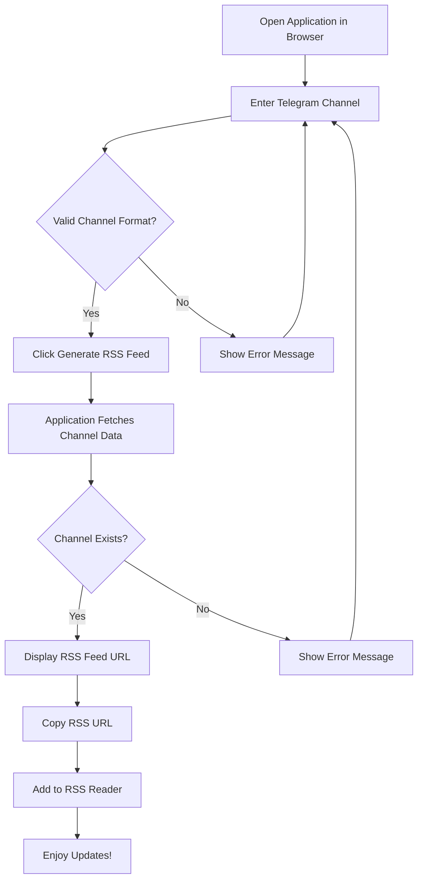
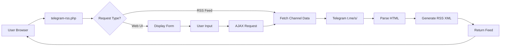

# xsukax Telegram RSS Feed Generator

A self-contained, privacy-focused RSS feed generator for Telegram public channels. This lightweight PHP application enables users to convert any public Telegram channel into a standard RSS 2.0 feed without relying on external APIs or third-party services.

## 🔒 Security and Privacy Benefits

This application prioritizes user privacy and data security through several architectural decisions:

- **Self-Hosted Architecture**: All processing occurs on your own server, ensuring complete control over data handling and eliminating dependence on external services that might track usage or store channel information
- **No External API Dependencies**: The application directly scrapes Telegram's public web interface, meaning no third-party RSS services have access to your channel subscriptions or reading habits
- **Zero Data Collection**: No user data, channel preferences, or usage statistics are collected, stored, or transmitted to any external parties
- **Public Content Only**: Designed exclusively for public Telegram channels, ensuring compliance with Telegram's terms of service and respecting content access permissions
- **Input Sanitization**: Comprehensive validation and sanitization of channel names prevent injection attacks and ensure only legitimate channels are processed
- **Secure Communication**: All requests to Telegram use HTTPS with SSL/TLS verification enabled, protecting data in transit

## ✨ Features and Advantages

- **Zero Configuration**: Single-file application with no external dependencies beyond standard PHP extensions
- **Universal Compatibility**: Works with any RSS reader (Feedly, Inoreader, NewsBlur, etc.)
- **Multiple Input Formats**: Accepts channel names in various formats (@username, t.me/username, full URLs)
- **Clean, Responsive Interface**: Modern web UI built with Tailwind CSS for easy feed generation
- **RSS 2.0 Standard Compliance**: Generates feeds that work seamlessly with all RSS readers
- **Real-Time Updates**: Feeds update automatically when your RSS reader requests new content
- **Lightweight and Fast**: Minimal resource footprint with efficient HTML parsing
- **Rich Content Preservation**: Maintains text formatting including bold, italic, and links
- **AJAX Support**: Smooth user experience with asynchronous form handling
- **Comprehensive Error Handling**: Clear feedback for invalid channels or connectivity issues

## 📋 Requirements

- PHP 7.4 or higher
- PHP Extensions (typically included by default):
  - `libxml`
  - `dom`
  - `mbstring`
- Web server (Apache, Nginx, or built-in PHP server)
- Internet connectivity to access Telegram's public web interface

## 🚀 Installation

### Option 1: Standard Web Server Installation

1. **Download the application**:
   ```bash
   wget https://raw.githubusercontent.com/xsukax/xsukax-Telegram-RSS-Feed-Generator/main/telegram-rss.php
   ```

2. **Deploy to your web server**:
   ```bash
   # For Apache
   sudo cp telegram-rss.php /var/www/html/
   
   # For Nginx
   sudo cp telegram-rss.php /usr/share/nginx/html/
   ```

3. **Set appropriate permissions**:
   ```bash
   sudo chmod 644 telegram-rss.php
   sudo chown www-data:www-data telegram-rss.php
   ```

4. **Access the application**:
   Open your browser and navigate to `http://your-domain.com/telegram-rss.php`

### Option 2: PHP Built-in Server (Development/Testing)

1. **Clone or download the file**:
   ```bash
   git clone https://github.com/xsukax/xsukax-Telegram-RSS-Feed-Generator.git
   cd xsukax-Telegram-RSS-Feed-Generator
   ```

2. **Start the PHP server**:
   ```bash
   php -S localhost:8000
   ```

3. **Access the application**:
   Open your browser to `http://localhost:8000/telegram-rss.php`

### Option 3: Docker Deployment

1. **Create a Dockerfile**:
   ```dockerfile
   FROM php:8.2-apache
   COPY telegram-rss.php /var/www/html/
   RUN chmod 644 /var/www/html/telegram-rss.php
   EXPOSE 80
   ```

2. **Build and run**:
   ```bash
   docker build -t telegram-rss-generator .
   docker run -d -p 8080:80 telegram-rss-generator
   ```

## 📖 Usage Guide

### Generating an RSS Feed



### Step-by-Step Instructions

1. **Open the Application**: Navigate to the application URL in your web browser

2. **Enter Channel Information**: In the input field, enter the Telegram channel using any of these formats:
   - Channel username: `channelname`
   - With @ symbol: `@channelname`
   - Short URL: `t.me/channelname`
   - Full URL: `https://t.me/channelname`
   - Preview URL: `https://t.me/s/channelname`

3. **Generate Feed**: Click the "Generate RSS Feed" button

4. **Copy RSS URL**: Once generated, copy the RSS feed URL using the "Copy" button

5. **Add to RSS Reader**: Paste the copied URL into your preferred RSS reader application

### Supported Channel Name Formats

| Format | Example | Valid |
|--------|---------|-------|
| Username only | `technews` | ✅ |
| With @ prefix | `@technews` | ✅ |
| t.me URL | `t.me/technews` | ✅ |
| Full URL | `https://t.me/technews` | ✅ |
| Preview URL | `https://t.me/s/technews` | ✅ |

### Direct Feed Access

You can also access feeds directly via URL without using the web interface:

```
http://your-domain.com/telegram-rss.php?feed=channelname
```

This is useful for programmatic access or direct RSS reader configuration.

### Application Architecture



## 🔧 Configuration

The application includes configurable constants at the top of the file:

```php
define('POSTS_PER_FEED', 50);  // Number of posts to include in each feed
define('USER_AGENT', 'Mozilla/5.0...');  // User agent for Telegram requests
```

To customize:
1. Open `telegram-rss.php` in a text editor
2. Modify the constant values
3. Save the file

## 🛠️ Troubleshooting

### Common Issues

**Issue**: "Could not fetch channel data"
- **Solution**: Verify the channel is public and exists. Private channels are not supported.

**Issue**: "Invalid channel name format"
- **Solution**: Ensure the channel name is 5-32 characters and contains only letters, numbers, and underscores.

**Issue**: Feed not updating in RSS reader
- **Solution**: Check your RSS reader's refresh interval settings. Most readers cache feeds for 15-60 minutes.

**Issue**: PHP errors about missing extensions
- **Solution**: Install required PHP extensions:
  ```bash
  sudo apt-get install php-xml php-mbstring
  ```

## 🤝 Contributing

Contributions are welcome! To contribute:

1. Fork the repository
2. Create a feature branch: `git checkout -b feature-name`
3. Commit your changes: `git commit -am 'Add new feature'`
4. Push to the branch: `git push origin feature-name`
5. Submit a pull request

Please ensure your code follows existing style conventions and includes appropriate comments.

## 📄 License

This project is licensed under the GNU General Public License v3.0.

## 🙏 Acknowledgments

- Built with standard PHP libraries (DOMDocument, DOMXPath)
- Styled with [Tailwind CSS](https://tailwindcss.com/)
- Inspired by the need for privacy-respecting RSS solutions

## 📞 Support

For issues, questions, or suggestions:
- Open an issue on [GitHub](https://github.com/xsukax/xsukax-Telegram-RSS-Feed-Generator/issues)
- Check existing issues for solutions to common problems

---

**Note**: This application only works with public Telegram channels. Private channels and groups are not supported due to Telegram's access restrictions.
